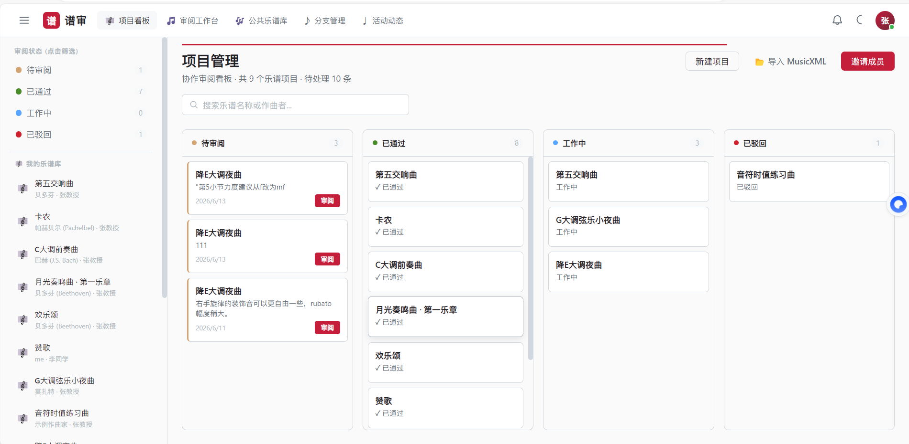
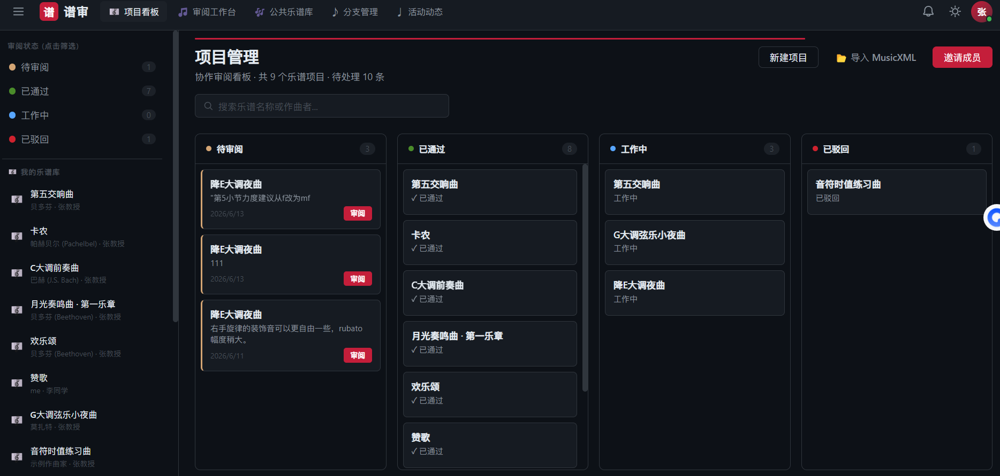
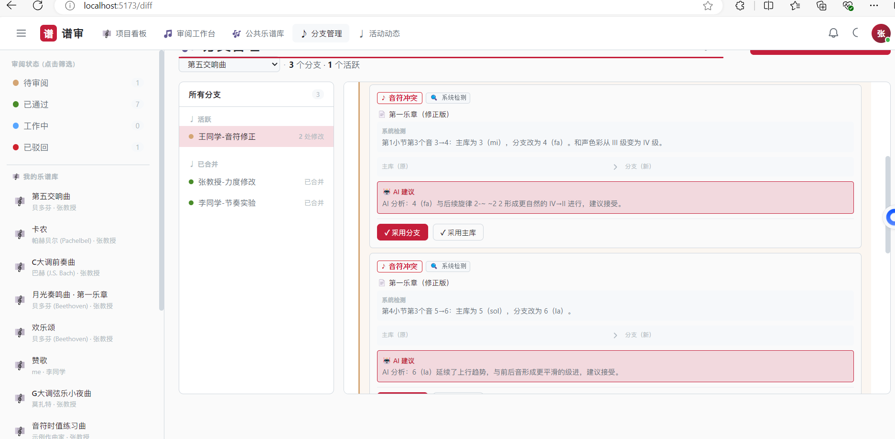
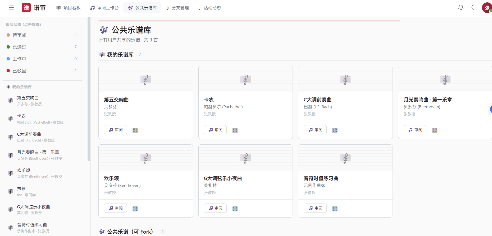
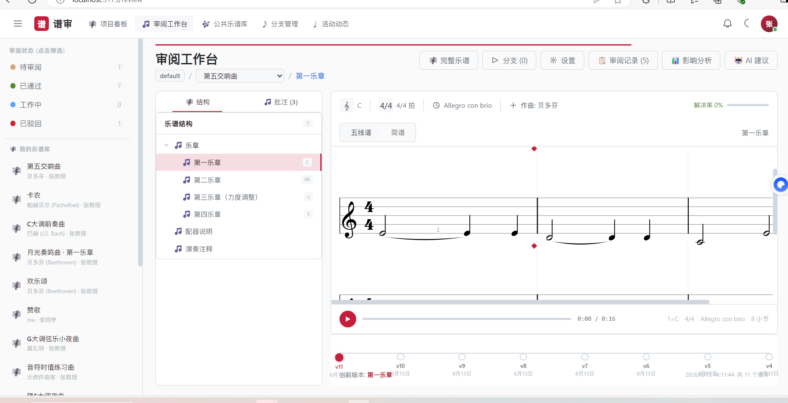

# 谱审 (Score Review) — 乐谱审阅管理系统

> 一个基于 Web 的协作式乐谱审阅平台，支持简谱/五线谱渲染、分支管理、AI 辅助审阅。
>
> **部分页面截图**







---

## 目录

- [功能概览](#功能概览)
- [技术栈](#技术栈)
- [快速开始](#快速开始)
- [项目结构](#项目结构)
- [功能模块](#功能模块)
- [API 文档](#api-文档)
- [截图](#截图)

---

## 功能概览

| 功能                | 说明                                    |
| ------------------- | --------------------------------------- |
| 🎼 **乐谱管理**     | 创建/编辑/删除乐谱，文件夹-乐段树形结构 |
| 𝄞 **简谱 & 五线谱** | 简谱解析渲染 + VexFlow 五线谱引擎       |
| 🎵 **批注审阅**     | 逐小节批注、批注状态流转、审阅历史      |
| 🌿 **分支管理**     | 基于分支的乐谱修改 → Diff 对比 → 合并   |
| 🤖 **AI 审阅**      | 三层过滤（规则→RAG→LLM）+ 优先级排序    |
| 🔀 **合并冲突**     | 音符级冲突检测 + AI 合并建议            |
| 📊 **影响分析**     | 速度/调号/拍号变更风险分析              |
| 👥 **协作**         | 成员邀请/申请、角色管理、通知系统       |
| 📋 **看板**         | 待审阅/已通过/工作中/已驳回四列看板     |
| 🔔 **通知**         | 合并/审阅/加入协作实时通知推送          |

---

## 技术栈

| 层级       | 技术                                    |
| ---------- | --------------------------------------- |
| 前端框架   | React 18 + TypeScript                   |
| 构建工具   | Vite                                    |
| 路由       | React Router v6                         |
| 状态管理   | Zustand                                 |
| 样式       | CSS Modules                             |
| 五线谱渲染 | VexFlow 4.x                             |
| 后端框架   | Express + TypeScript                    |
| 数据库     | MySQL 8+ (mysql2)                       |
| AI 服务    | 阿里云 DashScope（通义千问）            |
| 测试       | Vitest (前端) + Jest + Supertest (后端) |

---

## 快速开始

### 环境要求

- Node.js 18+
- MySQL 8+
- npm 或 yarn

### 1. 数据库初始化

```bash
# 创建数据库并导入表结构
mysql -u root -p < server/src/schema.sql

# 导入种子数据（可选）
mysql -u root -p < server/src/seed.sql
```

### 2. 配置环境变量

```bash
cp server/.env.example server/.env
```

编辑 `server/.env`：

```env
DB_HOST=localhost
DB_PORT=3306
DB_USER=root
DB_PASSWORD=your_password
DB_NAME=score_review

# AI 审阅（可选，不配置则降级为人工讨论）
DASHSCOPE_API_KEY=sk-your_key_here
```

### 3. 启动后端

```bash
cd server
npm install
npm run dev
# → http://localhost:3001
```

### 4. 启动前端

```bash
cd client
npm install
npm run dev
# → http://localhost:5173
```

### 5. 访问

浏览器打开 `http://localhost:5173`，默认账户：

| 用户   | 角色        | 说明           |
| ------ | ----------- | -------------- |
| 张教授 | admin       | 管理员，可审阅 |
| 李同学 | contributor | 协作成员       |
| 王同学 | contributor | 协作成员       |

---

## 项目结构

```
d:\React project\
├── client/                    # 前端 React 应用
│   ├── src/
│   │   ├── api/              # API 客户端 + Zustand stores
│   │   ├── components/
│   │   │   ├── annotation/   # 批注弹窗
│   │   │   ├── layout/       # 顶部导航 + 侧边栏
│   │   │   ├── notation/     # 简谱/五线谱渲染
│   │   │   ├── review/       # 审阅相关（AI面板/冲突卡片/影响分析）
│   │   │   └── shared/       # 通用组件（Button/Badge/Loading…）
│   │   ├── pages/            # 页面组件
│   │   ├── store/            # UI 状态（主题/通知/看板）
│   │   ├── styles/           # 全局样式 + Design Tokens
│   │   ├── types/            # TypeScript 类型
│   │   └── utils/            # 工具函数（简谱解析/VexFlow 封装）
│   └── index.html
├── server/                    # 后端 Express API
│   ├── src/
│   │   ├── routes/           # API 路由
│   │   ├── services/         # 业务逻辑（AI/冲突检测/影响分析/偏好学习）
│   │   ├── utils/            # 简谱解析（服务端）
│   │   ├── seed/             # 种子数据
│   │   ├── db.ts             # 数据库连接
│   │   ├── schema.sql        # 建表脚本
│   │   └── index.ts          # Express 入口
│   └── .env.example          # 环境变量模板
├── image/                     # 项目截图
├── 简谱规则/                   # GB/T 46845-2025 标准文档（RAG 知识库）
├── 五线谱规则/                 # GB/T 46846-2025 标准文档（RAG 知识库）
└── CLAUDE.md                  # 项目规范（Claude Code 配置）
```

---

## 功能模块

### 🎼 乐谱管理

乐谱以「文件夹-乐段」树形结构组织，支持：

- 创建/编辑/删除乐谱
- 文件夹嵌套（如「乐章」→「第一乐章」）
- 公开/私有切换
- 所有者转让

### 𝄞 简谱 & 五线谱

- **简谱引擎**：完整支持 GB/T 46845-2025 标准
  - 时值标记（增时线 `-` / 减时线 `_`）
  - 高低音点（`˙` / `.`）
  - 变音号（`#` / `b`）
  - 同音连线（`~`）
  - 圆滑线 `( )`、和弦 `[1 3 5]`
  - 附点、断音、重音、保持音、延长号
  - 力度标记、演奏法标记
- **五线谱引擎**：VexFlow 4.x SVG 渲染
  - 调号感知的音高映射
  - 自动符干朝向
  - 演奏法/力度标记
- **播放**：Web Audio API 合成器播放

### 🎵 批注审阅

- 在乐谱小节上添加批注
- 批注状态流转：待回复 → 已解决
- 自动触发审阅状态更新
- **AI 初审**：创建批注时三层过滤自动分析
  - Layer 1（规则层）：拦截无意义/非专业内容
  - Layer 2（RAG 层）：匹配 GB/T 46845/46846 标准规则（567 条）
  - Layer 3（AI 层）：DashScope LLM 分类 P0/P1/P2


### 🌿 分支管理

- 从主库复制创建独立分支
- 在分支上自由修改乐谱
- Diff 对比：主库 vs 分支（简谱/五线谱双视图）
- 合并到主库（自动版本保存）


### 🔀 智能合并冲突

- 音符级差异检测：音高/时值/八度/变音号/演奏法
- 系统层检测：调号/拍号/速度变更
- **AI 合并建议**：DashScope 分析差异并给出建议
- 一键采用主库/采用分支


### 🤖 AI 审阅

三层过滤流水线：

```
用户提交 → Layer 1 规则过滤 → Layer 2 RAG 规则库 → Layer 3 AI 分析 → 结果
              ↓ 拦截              ↓ 标准匹配          ↓ 分类
          auto_reject          auto_reject       P0/P1/P2
```

- **P0 紧急**：节拍错误、和声冲突、音域超限
- **P1 建议**：表情记号、力度微调、速度建议
- **P2 可忽略**：格式调整、措辞优化

### 📊 影响分析

- 速度变化 > 20BPM → 高风险
- 调号/拍号变更 → 高风险
- 内容长度变化 > 50% → 高风险
- 逐乐段分析，汇总风险等级

### 👥 协作

- 搜索昵称邀请成员
- 申请加入 → 建库人审批
- 角色：贡献者 / 审阅人
- 通知：邀请/加入/拒绝实时推送

---

## API 文档

### 核心 API

| 方法 | 路径                           | 说明                     |
| ---- | ------------------------------ | ------------------------ |
| POST | `/api/auth/login`              | 用户登录                 |
| POST | `/api/auth/register`           | 用户注册                 |
| GET  | `/api/scores`                  | 乐谱列表                 |
| POST | `/api/scores`                  | 创建乐谱                 |
| GET  | `/api/sections/score/:id/tree` | 乐段树                   |
| GET  | `/api/comments/section/:id`    | 批注列表                 |
| POST | `/api/comments`                | 创建批注（触发 AI 初审） |
| POST | `/api/branches`                | 创建分支                 |
| GET  | `/api/branches/:id/diff`       | 分支 Diff                |
| POST | `/api/branches/:id/merge`      | 合并分支                 |

### AI / Merge API

| 方法 | 路径                                    | 说明                   |
| ---- | --------------------------------------- | ---------------------- |
| POST | `/api/ai-review/analyze`                | AI 三层过滤分析        |
| GET  | `/api/ai-review/suggestions/:scoreId`   | 查看 AI 建议           |
| PUT  | `/api/ai-review/suggestions/:id/status` | 接受/驳回/忽略 AI 建议 |
| GET  | `/api/merge/conflicts/:branchId`        | 检测合并冲突           |
| POST | `/api/merge/conflicts/:id/resolve`      | 解决冲突               |
| POST | `/api/impact/analyze-section`           | 单乐段影响分析         |
| GET  | `/api/preferences/:userId/stats`        | 用户审阅统计           |

### 通知 API

| 方法 | 路径                                      | 说明     |
| ---- | ----------------------------------------- | -------- |
| GET  | `/api/notifications/:userId`              | 通知列表 |
| GET  | `/api/notifications/:userId/unread-count` | 未读数   |
| PUT  | `/api/notifications/:id/read`             | 标记已读 |
| PUT  | `/api/notifications/read-all/:userId`     | 全部已读 |

---

## 项目截图

### 项目看板

> 四列看板展示乐谱审阅状态：待审阅 / 已通过 / 工作中 / 已驳回


### 登录注册

> 音乐主题背景，支持账户密码 + 短信验证注册


### 完整乐谱

> 简谱 + 五线谱双视图，Web Audio 播放，导出 PDF


### 分支对比

> 主库 vs 分支差异显示，红绿标记原内容与新内容


### 合并冲突检测

> 系统检测冲突 + 🤖 AI 给出合并建议，一键采用主库/分支


---

## 开发

### 测试

```bash
# 后端测试
cd server && npm test

# 前端测试
cd client && npm test
```

### 代码风格

| 规范       | 标准                                   |
| ---------- | -------------------------------------- |
| React 组件 | PascalCase (`ScoreCard.tsx`)           |
| 文件/目录  | kebab-case (`file-tree/`)              |
| 函数/变量  | camelCase (`getScores()`)              |
| API 路由   | RESTful kebab-case (`/api/scores/:id`) |
| 数据库表   | 英文小写复数 (`scores`, `comments`)    |

---

## 许可

MIT License © 2024 谱审
